<h2 align="center">HccePose (BF)</h2>

<p align="center">
  <a href="https://arxiv.org/abs/2510.10177">
    
  </a>
  <a href="https://huggingface.co/datasets/SEU-WYL/HccePose">
    
  </a>
</p>

<p align="center">
  <a href="./README.md">English</a> | <a href="./README_CN.md">中文</a>
</p>
<!-- 

 -->

## 🧩 简介
HccePose(BF) 提出了一种 **层次化连续坐标编码（Hierarchical Continuous Coordinate Encoding, HCCE）** 机制，将物体表面点的三个坐标分量分别编码为层次化的连续代码。通过这种层次化的编码方式，神经网络能够有效学习 2D 图像特征与物体 3D 表面坐标之间的对应关系，也显著增强了网络对物体掩膜的学习能力。与传统方法仅学习物体可见正表面不同，**HccePose(BF)** 还学习了物体背表面的 3D 坐标，从而建立了更稠密的 2D–3D 对应关系，显著提升了位姿估计精度。

<div align="center">
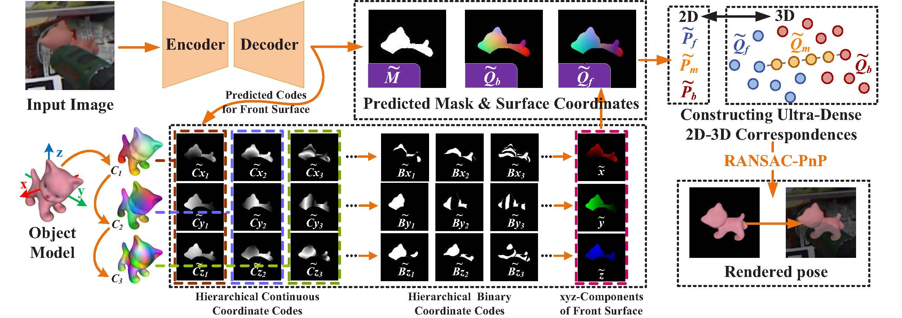
</div>

## ✨ 更新
--- 
- ⚠️ 注意：所有路径都必须使用绝对路径，以避免运行时错误。
- 2025.10.27: 我们发布了 cc0textures-512，这是原版 CC0Textures（44GB） 的轻量替代版本，体积仅 600MB。 👉 [点此下载](https://huggingface.co/datasets/SEU-WYL/HccePose/blob/main/cc0textures-512.zip)
- 2025.10.28: s4_p1_gen_bf_labels.py 已更新。若数据集中不存在 camera.json，脚本将自动创建一个默认文件。
- 2026.04.04：新增 **RGB-D 微调**（**FoundationPose** / **MegaPose**，`Refinement/` 与 `s4_p3_test_mi10_bin_picking_RGBD_*.py`）；**HccePose** 与 **FoundationPose** 的 **ONNX / TensorRT** 加速选项（`hccepose_acceleration`、`foundationpose_acceleration`）；`results_dict['time_dict']` 分阶段耗时与 `print_stage_time_breakdown`。示例 RGB-D 帧 **`000000`–`000003`** 已上传至 [Hugging Face — test_imgs_RGBD](https://huggingface.co/datasets/SEU-WYL/HccePose/tree/main/test_imgs_RGBD)（每帧 `{stem}_rgb.png`、`{stem}_depth.png`、`{stem}_camK.json`）。**Git** 可仍只内置 **`000003_*`**；多帧请从该目录同步到 **`test_imgs_RGBD/`**（可用 [`scripts/download_hf_assets.py`](scripts/download_hf_assets.py)；网页 Dataset card 用 [`hf-dataset-card/README.md`](hf-dataset-card/README.md) 上传为根目录 `README.md`，中文见 [`hf-dataset-card/README_CN.md`](hf-dataset-card/README_CN.md)）。
- 2026.04.04（文档）：快速开始与 RGB-D 小节明确 **OpenCV BGR** 约定（`cv2.imread` / `VideoCapture` 结果**原样**传入 `Tester.predict`），删除在 `imread` 后误加的 `COLOR_RGB2BGR`。代码注释与 BGR 训练归一化、FoundationPose 入口 BGR→RGB、MegaPose 可视化 BGR 拼图等实现对齐。
- 2026.04.06（文档）：**最小推理**清单、**首跑耗时**说明、**故障排查**、可选 [`requirements-inference.txt`](requirements-inference.txt)，以及建议在独立 **venv/conda** 中运行（ONNX 路径可能触发自动 `pip install`）。
---
<a id="environment-setup"></a>
## 🔧 环境配置

<details>
<summary>配置细节</summary>

下载 HccePose(BF) 项目并解压BOP等工具包
```bash
# 克隆项目
git clone https://github.com/WangYuLin-SEU/HCCEPose.git
cd HCCEPose

# 解压工具包
unzip bop_toolkit.zip
unzip blenderproc.zip
```
配置 Ubuntu 系统环境 (Python 3.10)

⚠️ 需要提前安装 带有 EGL 支持的显卡驱动

以下版本号与参考机上的 **Conda `py310`**（**Python 3.10.19**）在 `pip install` 后的 `pip list` 对齐（PyTorch 轮子在列表中可能显示 `+cu128` 等后缀）。

```bash
apt-get update && apt-get install -y wget software-properties-common gnupg2 python3-pip

apt-get update && apt-get install -y libegl1-mesa-dev libgles2-mesa-dev libx11-dev libxext-dev libxrender-dev

pip install torch==2.8.0 torchvision==0.23.0 torchaudio==2.8.0 --index-url https://download.pytorch.org/whl/cu128

apt-get update && apt-get install pkg-config libglvnd0 libgl1 libglx0 libegl1 libgles2 libglvnd-dev libgl1-mesa-dev libegl1-mesa-dev libgles2-mesa-dev cmake curl ninja-build

pip install ultralytics==8.3.233 fvcore==0.1.5.post20221221 pybind11==2.12.0 trimesh==4.2.2 ninja==1.11.1.1 kornia==0.6.9 open3d==0.19.0 transformations==2024.6.1 numpy==1.26.4 opencv-python==4.9.0.80 opencv-contrib-python==4.9.0.80

pip install scipy==1.15.3 kiwisolver==1.4.9 matplotlib==3.10.7 imageio==2.37.2 pypng Cython==3.2.1 PyOpenGL triangle glumpy Pillow==11.3.0 vispy imgaug mathutils pyrender pytz tqdm tensorboard kasal-6d==0.1.3 rich==14.2.0 h5py==3.15.1 diffrp-nvdiffrast

pip install bpy==3.6.0 --extra-index-url https://download.blender.org/pypi/

apt-get install libsm6 libxrender1 libxext-dev

python -c "import imageio; imageio.plugins.freeimage.download()"

pip install -U "huggingface_hub[hf_transfer]==0.36.0"

```

**单文件捷径（推理栈，不含 `bpy`）：** 在按上文安装好 **torch / torchvision / torchaudio**（CUDA 轮子源）之后，可执行 `pip install -r requirements-inference.txt`（详见该文件内注释）。若需 BlenderProc / 完整训练流程，仍请按需安装 **`bpy`** 一行。

<details>
<summary>可选：RGB-D 微调与加速</summary>

- **bop_toolkit**：请将 `bop_toolkit.zip` 解压到项目根目录的 **`bop_toolkit/`**，与训练、测试脚本的导入路径一致。
- **FoundationPose**（RGB-D 微调）：**nvdiffrast**（`import nvdiffrast.torch`，`Refinement/foundationpose.py`）由 **`diffrp-nvdiffrast`** 提供，已包含于上文主环境 `pip install` 列表。若需从源码构建，参见 [NVlabs/nvdiffrast](https://github.com/NVlabs/nvdiffrast)。**权重不包含在本仓库中。** 请从 [NVlabs/FoundationPose](https://github.com/NVlabs/FoundationPose) 文档 *Data prepare* 与 [Google Drive 权重包](https://drive.google.com/drive/folders/1DFezOAD0oD1BblsXVxqDsl8fj0qzB82i?usp=sharing) 获取，将 refiner / scorer 置于项目根目录 **`2023-10-28-18-33-37/`**、**`2024-01-11-20-02-45/`**（各含 `config.yml`、`model_best.pth`）。可选非官方镜像：[gpue/foundationpose-weights](https://huggingface.co/gpue/foundationpose-weights)（非 NVIDIA 托管，仅供不便访问 Drive 时选用）。**许可说明：** FoundationPose 权重使用须遵守其[官方许可](https://github.com/NVlabs/FoundationPose)，请勿默认可任意商用。
- **ONNX Runtime GPU / TensorRT**：HccePose 与 FoundationPose 可分别通过 `HccePose.hccepose_acceleration`、`Refinement.foundationpose_acceleration` 启用 ONNX 或 TensorRT；示例见 `s4_p3_test_mi10_bin_picking_onnx.py`、`s4_p3_test_mi10_bin_picking_tensorrt.py` 及 RGB-D 脚本中的相关参数。首次构造 `HccePose.tester.Tester` 且需要 ONNX/TensorRT 时，会调用 `ensure_acceleration_backend_environment` 自动安装/检查 **onnx** 与 **onnxruntime-gpu**；TensorRT 另需可用的 **libnvinfer**（如 `pip install tensorrt` 或在启动 Python 前将 TensorRT 的 `lib` 加入 `LD_LIBRARY_PATH`）。同一参考 **py310** 环境示例：**onnx==1.21.0**、**onnxruntime-gpu==1.23.2**、**tensorrt 10.16.x**（具体 CUDA 变体需与所用 ORT 构建一致）。
- **MegaPose**：首次 `register_megapose()` 或首次跑通 MegaPose 路径时，可**自动**克隆 [megapose6d](https://github.com/megapose6d/megapose6d.git) 至 **`third_party_megapose6d/`**，并用 **conda** 在项目根 **`.envs/megapose/`** 创建**独立的 Python 3.9 前缀**（`conda create -p … python=3.9`），在其中安装 MegaPose 所需的 **PyTorch/torchvision** 等，再下载模型（如 `local_data/megapose-models`，以上游为准）。**实际推理由子进程调用 `.envs/megapose/bin/python` 执行**，与 HccePose 主环境（例如 **Python 3.10**）分离：**请勿把 MegaPose 的 torch 栈装进 py310**，两套环境各司其职。宿主机需 **`conda`** 在 `PATH`，且项目目录可写、能联网。**许可说明：** MegaPose 代码与模型以 [megapose6d 官方许可](https://github.com/megapose6d/megapose6d)为准。

</details>

</details>

---

### 📥 从 Hugging Face 批量下载（可选）

**AutoDL 等环境**访问 Hugging Face（官网与 API）前，通常需要先开启平台提供的 **VPN / 学术加速**。若镜像中存在该文件：

```bash
source /etc/network_turbo
```

请在**同一终端会话**里再执行下方下载命令。开启加速后建议统一使用 **`--endpoint hf`**（直连官方 `huggingface.co`）；部分地区的第三方镜像可能对 **tree API** 返回 HTTP **403**。

[`scripts/download_hf_assets.py`](scripts/download_hf_assets.py) **仅在本 GitHub 仓库**，不在 Hugging Face 数据集文件列表中。在 **HCCEPose 仓库根目录**运行后，数据写入路径与 Quick Start / RGB-D 示例一致：`test_imgs/`、`test_videos/`、`test_imgs_RGBD/`、`demo-bin-picking/`、`demo-tex-objs/` 等位于克隆根目录，与手工从网页下载或维护者本机已配好环境**相同布局**。

```bash
source /etc/network_turbo   # 若存在
python scripts/download_hf_assets.py --preset test --endpoint hf
```

默认 `--dest` 为仓库根。`--endpoint auto` 先官方后 `https://hf-mirror.com`。详见 `python scripts/download_hf_assets.py --help`（含 **`--foundationpose`**，须核对许可）。Hugging Face Dataset 卡片用 [`hf-dataset-card/README.md`](hf-dataset-card/README.md)；中文 [`hf-dataset-card/README_CN.md`](hf-dataset-card/README_CN.md)。

**备选：`wget` 按文件拉取（`snapshot_download` 卡住或频繁断线时）** — [`scripts/wget_hf_demo_assets.py`](scripts/wget_hf_demo_assets.py) 通过 Hub **tree API** 枚举文件，用可断点续传的 **`wget -c`** 逐文件下载，并与 API 中的 **字节大小** 校验；会跳过 `test_imgs/`、`test_videos/` 下生成的 `*_show_*`。脚本会同时拉取 **FoundationPose** 四个权重文件到仓库根目录的 **`2023-10-28-18-33-37/`**、**`2024-01-11-20-02-45/`**（与 README 中手动 / Drive 布局一致）。在 AutoDL 等环境可先 `source /etc/network_turbo`（若存在）；将 pip 缓存与临时目录指到大盘，避免根分区写满，例如：`export PIP_CACHE_DIR=/path/to/big/pip-cache TMPDIR=/path/to/big/tmp`。

```bash
source /etc/network_turbo   # 若存在
cd HCCEPose
python scripts/wget_hf_demo_assets.py --endpoint hf              # 并行 wget（默认约 8 路）
python scripts/wget_hf_demo_assets.py --endpoint hf -j 4        # 限流，避免被 Hub 限速
python scripts/wget_hf_demo_assets.py --endpoint hf -j 1        # 严格顺序下载
python scripts/wget_hf_demo_assets.py --endpoint hf --verify-only # 仅校验大小
```

若未开加速时官方站不可达，请先 `source /etc/network_turbo`（或自备 VPN）再使用 `--endpoint hf`。仅在确认镜像的 **tree API** 可访问、无 403 时再尝试 `--endpoint mirror`。

---

<a id="minimal-inference-setup"></a>
## 🎯 最小推理环境（Bin-Picking RGB）

若你**只想**跑 **Bin-Picking 单目 RGB** 示例（**`s4_p3_test_mi10_bin_picking.py`**），不必先搭完整 BlenderProc 训练链，可按下列最小集合准备。

**仓库根目录必须具备**

| 内容 | 说明 |
|------|------|
| `HccePose/` | 核心代码（自 Git 克隆）。 |
| **`bop_toolkit/`** | `HccePose.bop_loader` 会 `import bop_toolkit` — 请在根目录解压 **`bop_toolkit.zip`**（或保持等效目录结构）。 |
| `demo-bin-picking/` | 含 `models/`、`yolo11/`、`HccePose/` 权重，布局与 [Hugging Face — demo-bin-picking](https://huggingface.co/datasets/SEU-WYL/HccePose/tree/main/demo-bin-picking) 一致。 |
| `test_imgs/` | 脚本中循环使用的示例 JPG。 |

**Python 环境**：请按上文 [环境配置](#environment-setup) 中的 **pip 版本钉** 安装（推荐 **Python 3.10**）。在安装好 **torch / torchvision / torchaudio**（CUDA 轮子的 `--index-url` 与 README 一致）之后，可用 [`requirements-inference.txt`](requirements-inference.txt) 一次性安装其余推理常用依赖（**不含** `bpy`）。

**仅跑上述脚本时通常不需要**

- **`blenderproc.zip`** 与 **`bpy`** — 面向 BlenderProc 合成数据与训练相关流程。
- **FoundationPose 权重目录**、**`test_imgs_RGBD/`**、**MegaPose / ONNX / TensorRT** — 仅在运行对应 **`s4_p3_test_*.py`** 时需要。

**建议**：为 HccePose 单独建 **conda 环境或 venv**。ONNX 相关脚本在首次构造 `Tester` 时可能通过 `ensure_acceleration_backend_environment` **自动执行 `pip install`**（如 `onnx`、`onnxruntime-gpu`），独立环境可避免污染系统 Python。

### ⏱ 首跑耗时（心理预期）

| 环节 | 说明 |
|------|------|
| **MegaPose**（如 `s4_p3_test_mi10_bin_picking_RGBD_megapose.py`） | **首次**可能需 **数十分钟**（克隆 `megapose6d`、在 `.envs/megapose/` 建 conda 前缀、安装 PyTorch 栈、下载模型等）。**同一机器、缓存仍在**时，再次运行通常可降至 **约一分钟量级**（视硬件与帧数而定）。 |
| **`download_hf_assets.py` / `wget_hf_demo_assets.py`** | 主要取决于带宽；在 AutoDL 等环境可先 `source /etc/network_turbo`（若存在）。 |
| **ONNX** | 首次以 ONNX 后端构造 `Tester` 时可能触发 **一次性** `pip` 安装 ONNX Runtime GPU 等。 |

### 🩹 故障排查（常见）

1. **`ValueError: All ufuncs must have type numpy.ufunc`**（多出现在 `scipy` / `imgaug` 调用链）：**NumPy 与 SciPy** 组合与参考环境不一致。请按 [环境配置](#environment-setup) 重装（例如 **`numpy==1.26.4`**、**`scipy==1.15.3`**），并在 **Python 3.10** 上验证。若使用 **Python 3.12** 等版本，需自行重新验证整组依赖，勿假设与 README 钉版本兼容。
2. **`ImportError: numpy.core.multiarray`** /  **`AttributeError: _ARRAY_API`**（`import cv2` 时）：OpenCV 的 wheel 与当前 **NumPy 主版本** 不匹配。请在同一环境中按 README 钉版本重装 **opencv** 与 **numpy**。
3. **TensorRT 脚本失败**（`s4_p3_test_mi10_bin_picking_tensorrt.py`）：需匹配可用的 **`libnvinfer`** / 驱动与 TensorRT 栈。验证主流程时可先只跑 **`hccepose_acceleration='pytorch'`** 或 **`'onnx'`**；TensorRT 视为可选项。

---

## 🧱 自定义数据集及训练

#### 🎨 物体预处理

<details>
<summary>点击展开</summary>

以 [**`demo-bin-picking`**](https://huggingface.co/datasets/SEU-WYL/HccePose/tree/main/demo-bin-picking) 数据集为例，我们首先使用 **SolidWorks** 设计物体模型，并导出为 STL 格式的三维网格文件。  
STL 文件下载链接：🔗 https://huggingface.co/datasets/SEU-WYL/HccePose/blob/main/raw-demo-models/multi-objs/board.STL

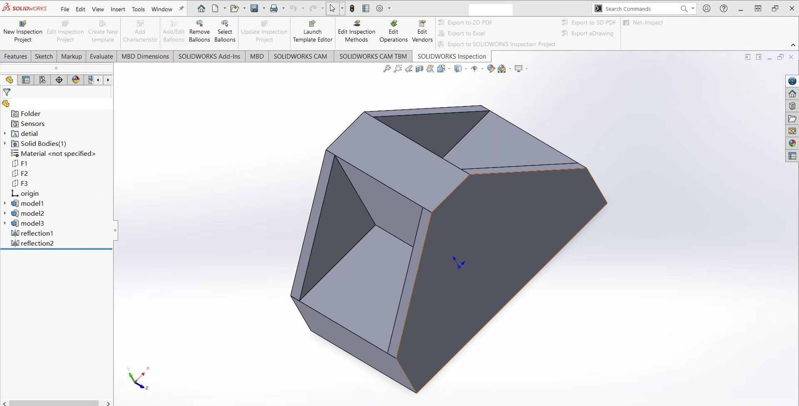

随后，在 **MeshLab** 中导入该 STL 文件，并使用 **`Vertex Color Filling`** 工具为模型表面着色。

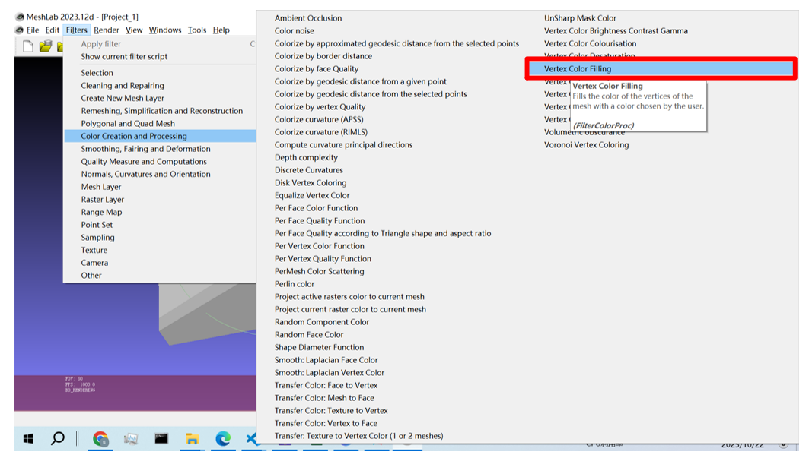
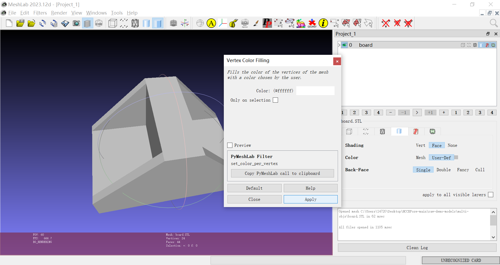

接着，将物体模型以 **非二进制 PLY 格式** 导出，并确保包含顶点颜色与法向量信息。

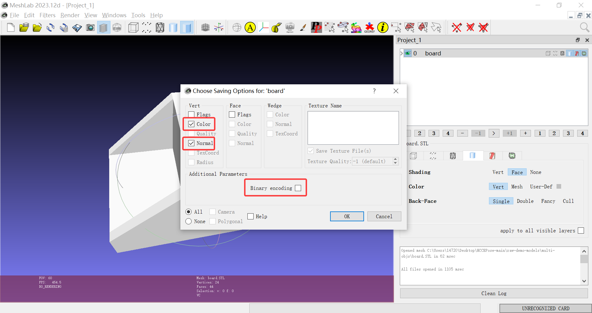

导出的模型中心通常与坐标系原点不重合（如下图所示）：

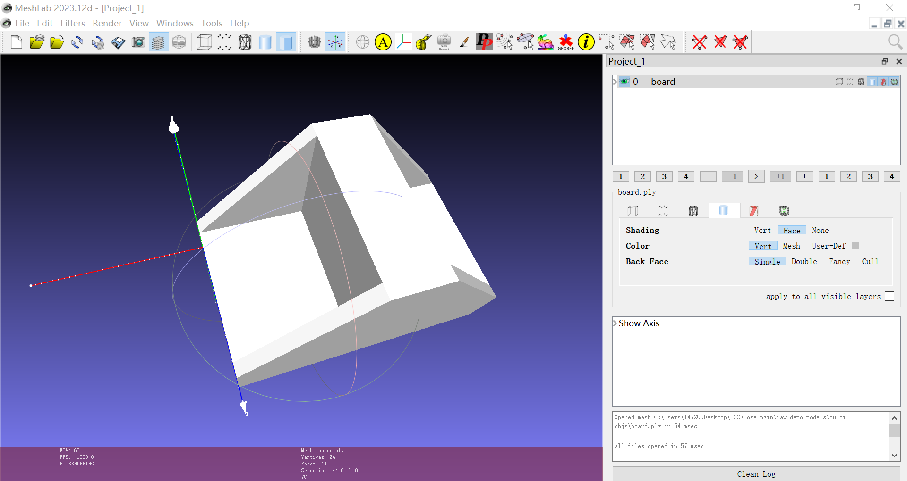

为解决模型中心偏移问题，可使用脚本 **`s1_p1_obj_rename_center.py`**：该脚本会加载 PLY 文件，将模型中心对齐至坐标系原点，并根据 BOP 规范重命名文件。用户需手动设置非负整数参数 **`obj_id`**，每个物体对应唯一编号。  

例如：

| **`input_ply`** | **`obj_id`** | **`output_ply`** |
| :---: | :---: | :---: |
| **`board.ply`** | **`1`** | **`obj_000001.ply`** |
| **`board.ply`** | **`2`** | **`obj_000002.ply`** |


当所有物体完成中心化与重命名后，将这些文件放入名为 **`models`** 的文件夹中，目录结构如下：

```bash
数据集名称
|--- models
      |--- obj_000001.ply
      ...
      |--- obj_000015.ply
```

---

</details>

#### 🌀 物体旋转对称分析

<details>
<summary>点击展开</summary>

在位姿估计任务中，许多物体存在多种旋转对称性，如圆柱、圆锥或多面体旋转对称。对于这些旋转对称物体，需要使用 KASAL 工具生成符合 BOP 规范的旋转对称先验。

KASAL 项目地址：🔗 https://github.com/WangYuLin-SEU/KASAL

安装命令：

```bash
pip install kasal-6d
```

运行以下代码可启动 **KASAL 图形界面**：

```python
from kasal.app.polyscope_app import app
mesh_path = 'demo-bin-picking'
app(mesh_path)
```

KASAL 会自动遍历 **`mesh_path`** 文件夹下所有 PLY 或 OBJ 文件（不加载 **`_sym.ply`** 等效果文件）。

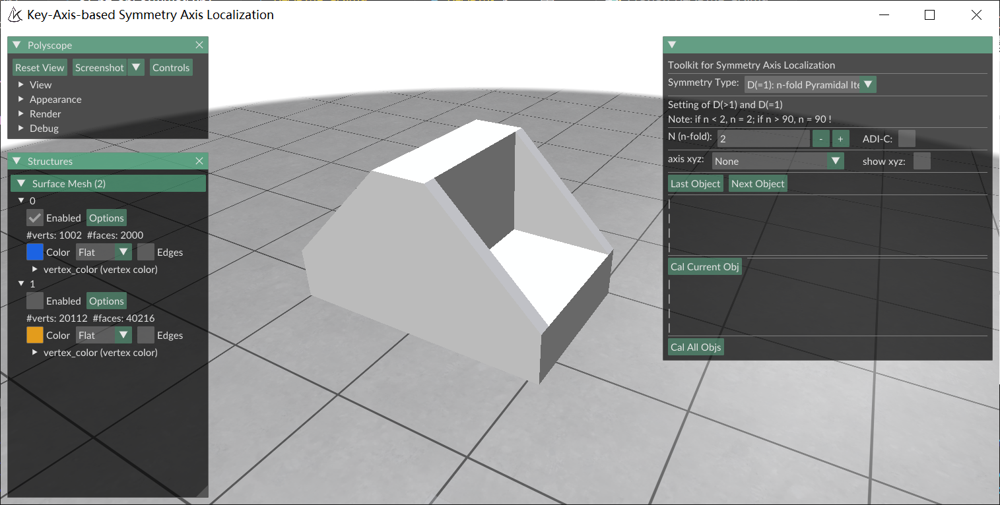

在使用界面中：
* 下拉 **`Symmetry Type`** 选择旋转对称类型
* 对于 n 阶棱锥或棱柱旋转对称，需设置 **`N (n-fold)`**
* 对纹理旋转对称物体，勾选 **`ADI-C`**
* 若结果不准确，可通过 **`axis xyz`** 手动强制拟合

KASAL 将旋转对称划分为 **8 种类型**。若选择错误类型，将在可视化中显示异常，从而可辅助判断设置是否正确。

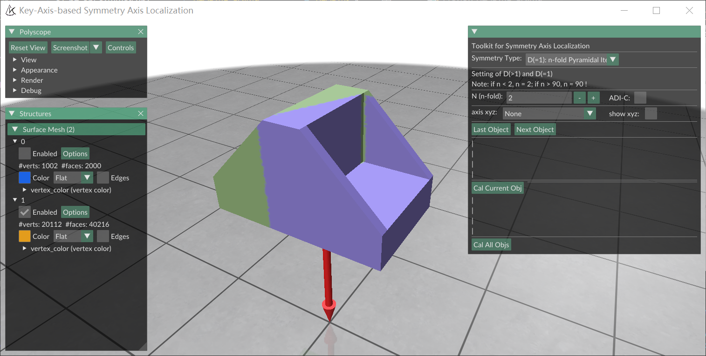

点击 **`Cal Current Obj`** 可计算当前物体的旋转对称轴，旋转对称先验将保存为 **`_sym_type.json`** 文件，例如：
* 旋转对称先验文件：**`obj_000001_sym_type.json`**
* 可视化文件：**`obj_000001_sym.ply`**

---
</details>

#### 🧾 BOP 格式模型信息生成

<details>
<summary>点击展开</summary>

运行脚本 **`s1_p3_obj_infos.py`**，该脚本会遍历 **`models`** 文件夹下所有满足 BOP 规范的 **`ply`** 文件及其对应的旋转对称文件，并最终生成标准的 **`models_info.json`** 文件。

生成后的目录结构如下：

```bash
数据集名称
|--- models
      |--- models_info.json
      |--- obj_000001.ply
      ...
      |--- obj_000015.ply
```

---
</details>


#### 🔥 渲染 PBR 数据集

<details>
<summary>点击展开</summary>

在 **BlenderProc** 的基础上，我们改写了一个用于渲染新数据集的脚本 **`s2_p1_gen_pbr_data.py`**。直接通过 Python 调用该脚本可能会导致 **内存泄漏（memory leak）**，随着渲染周期的增长，内存占用会逐渐增加，从而显著降低渲染效率。为了解决这一问题，我们提供了一个 **Shell 脚本** —— **`s2_p1_gen_pbr_data.sh`**，用于循环调用 **`s2_p1_gen_pbr_data.py`**，以此有效缓解内存累积问题，并显著提升渲染效率。此外，我们还针对 BlenderProc 进行了部分代码微调，以更好地适配新数据集的 PBR 数据制备流程。  

---

#### 渲染前准备

在渲染 PBR 数据前，需要使用 **`s2_p0_download_cc0textures.py`** 下载 **CC0Textures** 材质库。下载完成后，文件夹结构应如下所示：
```
HCCEPose
|--- s2_p0_download_cc0textures.py
|--- cc0textures
```

---

**cc0textures** 约占用 **44GB** 硬盘空间，体积较大。
为降低存储需求，我们制作了一个轻量级替代版本 **cc0textures-512**，其大小仅约 **600MB**。
下载链接如下：
👉 https://huggingface.co/datasets/SEU-WYL/HccePose/blob/main/cc0textures-512.zip

在运行渲染脚本时，只需将 **`cc0textures`** 的路径替换为 **`cc0textures-512`**，即可直接使用该轻量材质库。
（可以仅下载 **`cc0textures-512`**，无需下载原始的 **`cc0textures`**。）

---

#### 渲染执行

**`s2_p1_gen_pbr_data.py`** 用于生成 PBR 数据，该脚本基于 [BlenderProc2](https://github.com/DLR-RM/BlenderProc) 进行了改写。

执行命令如下：

```bash
cd HCCEPose
chmod +x s2_p1_gen_pbr_data.sh
nohup ./s2_p1_gen_pbr_data.sh 0 42 xxx/xxx/cc0textures xxx/xxx/demo-bin-picking xxx/xxx/s2_p1_gen_pbr_data.py > s2_p1_gen_pbr_data.log 2>&1 &
```

**文件结构说明**

按照上述命令运行后，程序会：
- 调用 **`xxx/xxx/cc0textures`** 中的材质库；
- 使用 **`xxx/xxx/demo-bin-picking/models`** 文件夹下的物体模型；
- 在 **`xxx/xxx/demo-bin-picking`** 文件夹下生成 **42 个文件夹**，每个文件夹包含 **1000 帧 PBR 渲染图像**。

最终生成的文件结构如下：
```
demo-bin-picking
|--- models
|--- train_pbr
      |--- 000000
      |--- 000001
      ...
      |--- 000041
```

---

</details>

#### 🚀 训练 2D 检测器

<details>
<summary>点击展开</summary>

在 6D 位姿估计任务中，通常需要首先通过 **2D 检测器** 来确定物体的包围盒区域，并基于包围盒图像进一步推断物体的 **6D 位姿**。相比直接从整幅图像中预测 6D 位姿，**“2D 检测 + 6D 位姿估计”** 的两阶段方法在精度与稳定性方面表现更优。因此，本项目为 **HccePose(BF)** 配备了一个基于 **YOLOv11** 的 2D 检测器。  

以下将介绍如何将 **BOP 格式的 PBR 训练数据** 转换为 YOLO 可用的数据格式，并进行 YOLOv11 的训练。

---

####  转换 BOP PBR 训练数据为 YOLO 训练数据

为实现 BOP 格式 PBR 数据与 YOLO 数据的自动转换，我们提供了 **`s3_p1_prepare_yolo_label.py`** 脚本。在指定路径 **`xxx/xxx/demo-bin-picking`** 后运行该脚本，程序将在 **`demo-bin-picking`** 文件夹下生成一个新的 **`yolo11`** 文件夹。

生成后的目录结构如下：
```
demo-bin-picking
|--- models
|--- train_pbr
|--- yolo11
      |--- train_obj_s
            |--- images
            |--- labels
            |--- yolo_configs
                |--- data_objs.yaml
            |--- autosplit_train.txt
            |--- autosplit_val.txt
```

其中：  
- **`images`** → 存放 2D 训练图像  
- **`labels`** → 存放 2D BBox 标签文件  
- **`data_objs.yaml`** → YOLO 训练配置文件  
- **`autosplit_train.txt`** → 训练集样本列表  
- **`autosplit_val.txt`** → 验证集样本列表  

---

#### 训练 YOLOv11 检测器

为训练 YOLOv11 检测器，我们提供了 **`s3_p2_train_yolo.py`** 脚本。 在指定路径 **`xxx/xxx/demo-bin-picking`** 后运行该脚本，  程序将自动训练 YOLOv11，并保存最佳权重文件 **`yolo11-detection-obj_s.pt`**。  

训练完成后，文件结构如下：

```
demo-bin-picking
|--- models
|--- train_pbr
|--- yolo11
      |--- train_obj_s
            |--- detection
                |--- obj_s
                    |--- yolo11-detection-obj_s.pt
            |--- images
            |--- labels
            |--- yolo_configs
                |--- data_objs.yaml
            |--- autosplit_train.txt
            |--- autosplit_val.txt
```

---

#### ⚠️ 注意事项
**`s3_p2_train_yolo.py`** 会循环扫描 **`detection`** 文件夹下的 **`yolo11-detection-obj_s.pt`** 文件。
此机制能够在训练程序因意外中断后自动恢复训练，特别适用于云服务器等不便实时监控训练进度的环境，可避免设备长时间空置造成的资源浪费。
但若需要重新开始训练，请务必先删除 **`yolo11-detection-obj_s.pt`** 文件，否则该文件的存在会使程序继续从中断点恢复训练，而无法重新初始化。

---
</details>


#### 🧩 物体正背面标签制备

<details>
<summary>点击展开</summary>

在 **HccePose(BF)** 中，网络同时学习物体的 **正表面 3D 坐标** 与 **背表面 3D 坐标**。为生成这些正背面标签，我们分别渲染物体的正面和背面深度图。

在渲染物体正面深度图时，通过设置 **`gl.glDepthFunc(gl.GL_LESS)`** 保留最小深度值（即距离相机最近的表面），这些表面被定义为物体的 **正面**，该定义参考了渲染流程中“正背面剔除”的概念。相应地，在渲染背面深度图时，设置 **`gl.glDepthFunc(gl.GL_GREATER)`** 保留最大的深度值（即距离相机最远的表面），这些表面被定义为物体的 **背面**。最终，基于深度图与物体的 6D 位姿真值，可生成正背面的 **3D 坐标标签图**。

---

#### 旋转对称处理与真值校正

对于旋转对称物体，我们将 **离散** 与 **连续旋转对称** 统一表示为旋转对称矩阵集合，并基于该集合与物体真值位姿计算新的真值位姿集合。为保持 6D 位姿标签的唯一性，从中选取与单位矩阵 **L2 距离最小** 的真值位姿作为最终标签。

此外，依据相机成像原理，当物体发生平移而旋转不变时，在固定视角下会产生“**视觉上的旋转**”。对于旋转对称物体，这种视觉旋转会导致错误的 3D 坐标标签图。为修正此类误差，我们根据渲染得到的深度图计算物体的 3D 坐标，并使用 **RANSAC PnP** 对旋转进行校正。

---

#### 批量标签生成

基于上述思路，我们实现了 **`s4_p1_gen_bf_labels.py`**，该脚本支持多进程渲染，能够批量生成物体正背面的 3D 坐标标签图。指定数据集路径 **`/root/xxxxxx/demo-bin-picking`** 以及其中的文件夹 **`train_pbr`**，运行脚本后将生成两个新文件夹：  

- **`train_pbr_xyz_GT_front`**：存储正面 3D 坐标标签图  
- **`train_pbr_xyz_GT_back`**：存储背面 3D 坐标标签图  

目录结构如下：

```
demo-bin-picking
|--- models
|--- train_pbr
|--- train_pbr_xyz_GT_back
|--- train_pbr_xyz_GT_front
```

以下示例展示了三张对应的图像：  
原始渲染图、正面 3D 坐标标签图、背面 3D 坐标标签图。
<p align="center">
  
  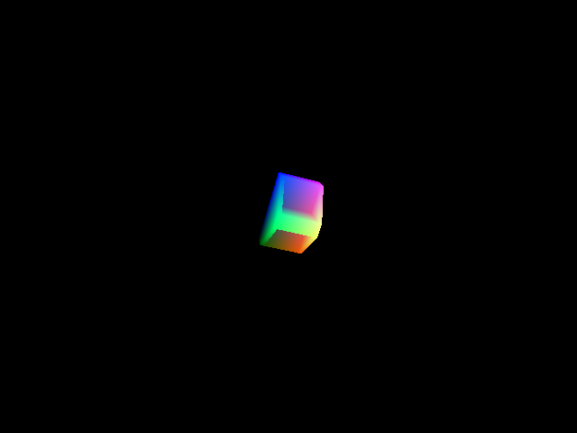
  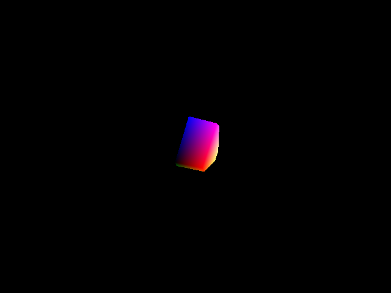
</p>

---

</details>

#### 🚀 训练 HccePose(BF)

<details>
<summary>点击展开</summary>

在训练 **HccePose(BF)** 时，需要为每个物体单独训练一个对应的权重模型。  
通过 **`s4_p2_train_bf_pbr.py`** 脚本，可以实现 **批量物体的多卡训练**。

以 `demo-tex-objs` 数据集为例，训练完成后的文件夹结构如下：
```
demo-tex-objs
|--- HccePose
    |--- obj_01
    ...
    |--- obj_10
|--- models
|--- train_pbr
|--- train_pbr_xyz_GT_back
|--- train_pbr_xyz_GT_front
```

在使用 **`s4_p2_train_bf_pbr.py`** 时，可通过参数 **`ide_debug`** 切换单卡与多卡模式：  
- 当 `ide_debug=True` 时，仅使用 **单卡**，适合在 IDE 中调试；  
- 当 `ide_debug=False` 时，启用 **DDP（分布式数据并行）训练** 模式。  

在 VSCode 等 IDE 中直接挂起 DDP 训练可能会引发通讯问题，因此推荐使用以下命令在后台运行多卡训练：
```
screen -S train_ddp
nohup python -u -m torch.distributed.launch --nproc_per_node 6 /root/xxxxxx/s4_p2_train_bf_pbr.py > log4.file 2>&1 &
``` 

如果仅需单卡运行或调试，可直接使用：

```
nohup python -u /root/xxxxxx/s4_p2_train_bf_pbr.py > log4.file 2>&1 &
```  


---

#### 训练范围设置

若需训练多个物体，可通过 **`start_obj_id`** 与 **`end_obj_id`** 参数设置物体 ID 范围。 例如，`start_obj_id=1` 且 `end_obj_id=5` 时，脚本会依次训练 `obj_000001.ply` 至 `obj_000005.ply`。若仅训练单个物体，则将两者设置为相同的数字即可。

此外，可根据实际需求修改 **`total_iteration`**，其默认值为 `50000`。在 DDP 训练中，实际训练的样本数量可通过以下公式计算：
```
total samples = total iteration × batch size × GPU number
```

---

</details>

---


## ✏️ 快速开始

> **最快跑通一条 demo：** 见 [最小推理环境（Bin-Picking RGB）](#minimal-inference-setup) — 仅需 Bin-Picking RGB，无需 BlenderProc / `bpy`。

针对 **Bin-Picking** 问题，本项目提供了一个基于 **HccePose(BF)** 的简易应用示例。  
为降低复现难度，示例使用的物体（由普通 3D 打印机以白色 PLA 材料打印）和相机（小米手机）均为常见易得设备。  

您可以：
- 多次打印示例物体
- 任意摆放打印物体
- 使用手机自由拍摄
- 直接利用本项目提供的权重完成 2D 检测、2D 分割与 6D 位姿估计
---

> 请保持文件夹层级结构不变

| 类型             | 资源链接                                                                                             |
| -------------- | ------------------------------------------------------------------------------------------------ |
| 🎨 物体 3D 模型    | [demo-bin-picking/models](https://huggingface.co/datasets/SEU-WYL/HccePose/tree/main/demo-bin-picking/models)     |
| 📁 YOLOv11 权重  | [demo-bin-picking/yolo11](https://huggingface.co/datasets/SEU-WYL/HccePose/tree/main/demo-bin-picking/yolo11)     |
| 📂 HccePose 权重 | [demo-bin-picking/HccePose](https://huggingface.co/datasets/SEU-WYL/HccePose/tree/main/demo-bin-picking/HccePose) |
| 🖼️ 测试图片       | [test_imgs](https://huggingface.co/datasets/SEU-WYL/HccePose/tree/main/test_imgs)                |
| 🎥 测试视频        | [test_videos](https://huggingface.co/datasets/SEU-WYL/HccePose/tree/main/test_videos)            |
| 📷 RGB-D（Hugging Face） | [test_imgs_RGBD](https://huggingface.co/datasets/SEU-WYL/HccePose/tree/main/test_imgs_RGBD) — **`000000`–`000003`**（`{stem}_rgb.png`、`{stem}_depth.png`、`{stem}_camK.json`）。示例：`hf download … --include "test_imgs_RGBD/*"` 或 [`scripts/download_hf_assets.py`](scripts/download_hf_assets.py) `--preset test` |
| 📷 RGB-D（Git 极简） | **`test_imgs_RGBD/`** 在 git 中可仅含 **`000003_*`**；多帧请同步到本地 `test_imgs_RGBD/` |

> ⚠️ 注意：
文件名以 train 开头的压缩包仅在训练阶段使用，快速开始部分只需下载上述测试文件。

---

#### ⏳ 模型与加载器
测试时，需要从以下模块导入：
- **`HccePose.tester`** → 提供集成式测试器（2D 检测、分割、6D 位姿估计全流程）
- **`HccePose.bop_loader`** → 基于 BOP 格式的数据加载器，用于加载物体模型文件和训练数据

---

#### 📸 示例测试
下图展示了实验场景：  
<details>
<summary>点击展开</summary>
我们将多个白色 3D 打印物体放入碗中，并放置在白色桌面上，随后用手机拍摄。  
原始图像示例如下 👇  
<div align="center">
 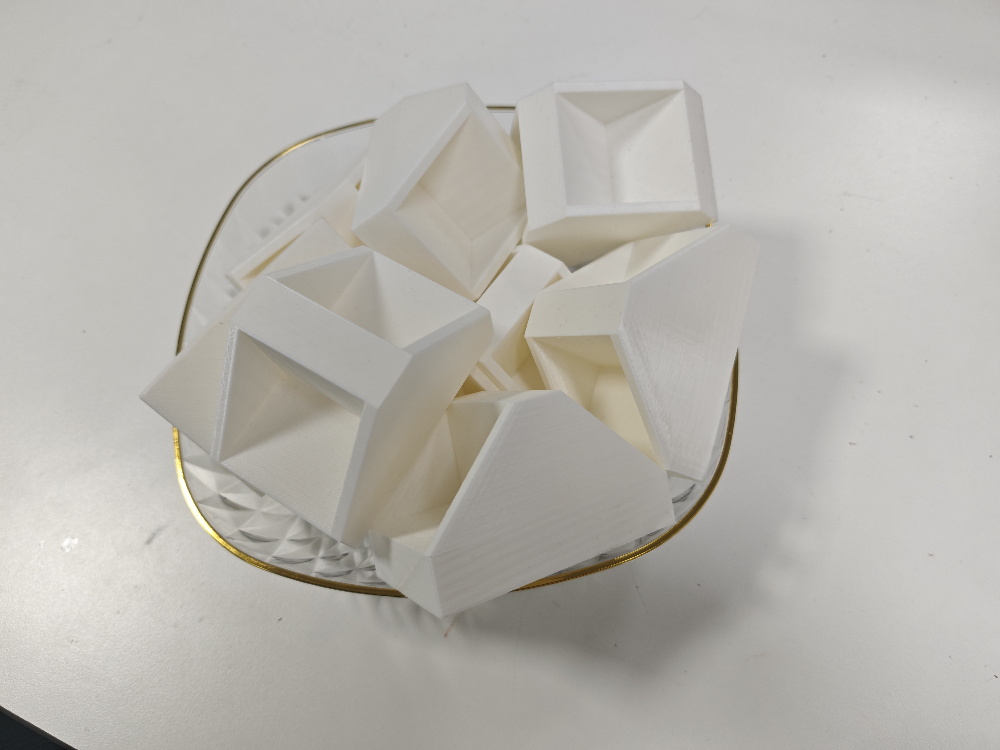
</div>

该图像来自：[示例图片链接](https://github.com/WangYuLin-SEU/HCCEPose/blob/main/test_imgs/IMG_20251007_165718.jpg)

</details>

随后，可直接使用以下脚本进行 6D 位姿估计与可视化：

> **颜色约定：** `cv2.imread` / `VideoCapture.read` 均为 **BGR** `uint8`，请**原样**传入 `Tester.predict`（与 `s4_p3_test_mi10_bin_picking.py` 一致）。HccePose 使用 `IMAGENET_MEAN_BGR` 等做归一化。FoundationPose 在 `Refinement_FP.inference_batch` 内做 BGR→RGB。MegaPose 上游用 RGB，**调试拼图**为 BGR 以便 `cv2.imwrite`。

<details>
<summary>点击展开代码</summary>

```python
import cv2, os, sys
import numpy as np
from HccePose.bop_loader import bop_dataset
from HccePose.test_script_utils import print_stage_time_breakdown, save_visual_artifacts
from HccePose.tester import Tester

if __name__ == '__main__':
    sys.path.insert(0, os.getcwd())
    current_dir = os.path.dirname(sys.argv[0])
    dataset_path = os.path.join(current_dir, 'demo-bin-picking')
    test_img_path = os.path.join(current_dir, 'test_imgs')
    bop_dataset_item = bop_dataset(dataset_path)
    obj_id = 1
    CUDA_DEVICE = '0'
    hccepose_vis = True
    save_visualizations = hccepose_vis
    print_stage_timing = False
    hccepose_acceleration = 'pytorch'

    Tester_item = Tester(
        bop_dataset_item,
        hccepose_vis=hccepose_vis,
        CUDA_DEVICE=CUDA_DEVICE,
        hccepose_acceleration=hccepose_acceleration,
    )
    for name in ['IMG_20251007_165718']:
        file_name = os.path.join(test_img_path, '%s.jpg' % name)
        image = cv2.imread(file_name)
        cam_K = np.array([
            [2.83925618e+03, 0.00000000e+00, 2.02288638e+03],
            [0.00000000e+00, 2.84037288e+03, 1.53940473e+03],
            [0.00000000e+00, 0.00000000e+00, 1.00000000e+00],
        ])
        results_dict = Tester_item.predict(
            cam_K, image, [obj_id], conf=0.85, confidence_threshold=0.85,
        )
        print_stage_time_breakdown(results_dict, enabled=print_stage_timing, prefix=name)
        save_visual_artifacts([
            (file_name.replace('.jpg', '_show_2d.jpg'), results_dict.get('show_2D_results')),
            (file_name.replace('.jpg', '_show_6d_vis0.jpg'), results_dict.get('show_6D_vis0')),
            (file_name.replace('.jpg', '_show_6d_vis1.jpg'), results_dict.get('show_6D_vis1')),
            (file_name.replace('.jpg', '_show_6d_vis2.jpg'), results_dict.get('show_6D_vis2')),
        ], enabled=save_visualizations)
```

完整参数与加速选项见仓库脚本 **`s4_p3_test_mi10_bin_picking.py`**。

**视频脚本：** **`s4_p3_test_mi10_bin_picking_video.py`**、**`s4_p3_test_mi10_tex_objs_video.py`** 会按帧处理 **`test_videos/`** 下整段视频，**耗时明显更长**。日常冒烟/校验可优先用上文单图脚本；需要完整序列输出时再跑 **`*_video.py`**。

</details>

---

#### 🎯 可视化结果

2D 检测结果 (_show_2d.jpg)：

<div align="center"> 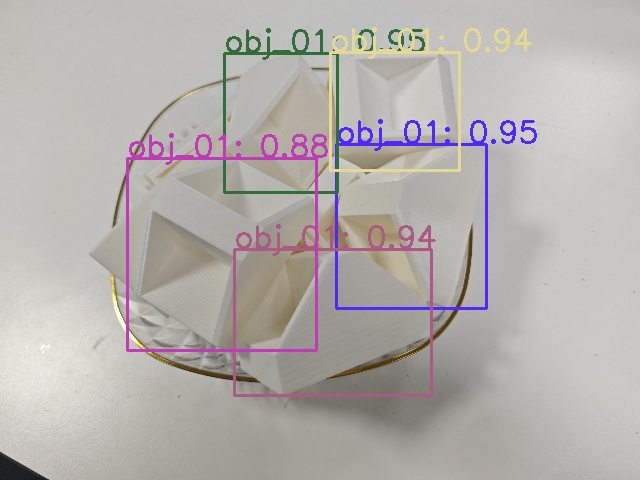 </div>


网络输出结果：

- 基于 HCCE 的前后表面坐标编码

- 物体掩膜

- 解码后的 3D 坐标可视化

<div align="center"> 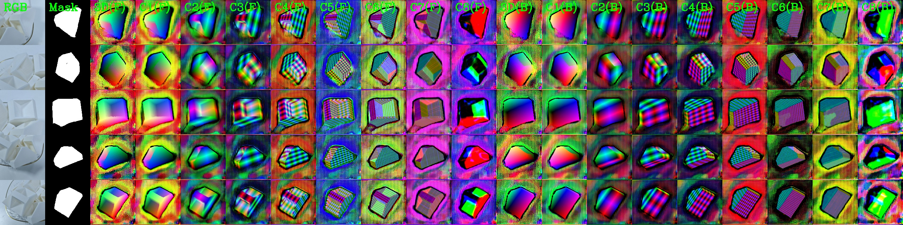 
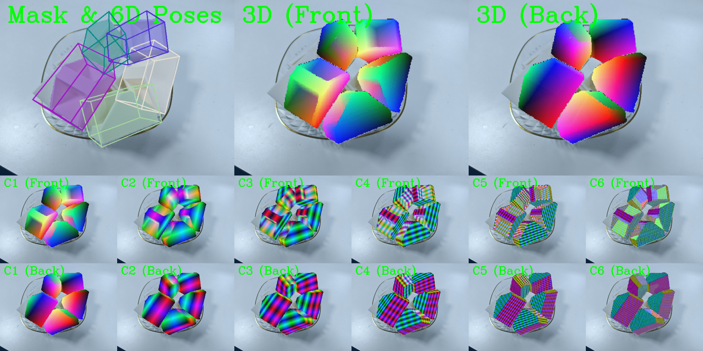 </div> 

---

#### 💫 如果觉得本教程对你有帮助

欢迎给项目点个 ⭐️ 支持一下！你的 Star 是我们持续完善文档和更新代码的最大动力 🙌

---
#### 🎥 视频的6D位姿估计

<details>
<summary>具体内容</summary>

基于单帧图像的位姿估计流程，可以轻松扩展至视频序列，从而实现对连续帧的 6D 位姿估计，代码如下：
<details>
<summary>点击展开代码</summary>

```python
import cv2, os, sys
import numpy as np
from HccePose.bop_loader import bop_dataset
from HccePose.test_script_utils import print_stage_time_breakdown
from HccePose.tester import Tester

if __name__ == '__main__':
    sys.path.insert(0, os.getcwd())
    current_dir = os.path.dirname(sys.argv[0])
    dataset_path = os.path.join(current_dir, 'demo-bin-picking')
    test_video_path = os.path.join(current_dir, 'test_videos')
    bop_dataset_item = bop_dataset(dataset_path)
    obj_id = 1
    CUDA_DEVICE = '0'
    hccepose_vis = True
    hccepose_acceleration = 'pytorch'
    save_visualizations = hccepose_vis
    print_stage_timing = False

    Tester_item = Tester(
        bop_dataset_item,
        hccepose_vis=hccepose_vis,
        CUDA_DEVICE=CUDA_DEVICE,
        hccepose_acceleration=hccepose_acceleration,
    )
    for name in ['VID_20251009_141247']:
        file_name = os.path.join(test_video_path, '%s.mp4' % name)
        cap = cv2.VideoCapture(file_name)
        fps = cap.get(cv2.CAP_PROP_FPS)
        fourcc = cv2.VideoWriter_fourcc(*'mp4v')
        out_1 = None
        out_2 = None
        cam_K = np.array([
            [1.63235512e+03, 0.00000000e+00, 9.74032712e+02],
            [0.00000000e+00, 1.64159967e+03, 5.14229781e+02],
            [0.00000000e+00, 0.00000000e+00, 1.00000000e+00],
        ])
        while cap.isOpened():
            ret, frame = cap.read()
            if not ret:
                break
            # 视频帧已是 BGR，与 imread 一致。
            results_dict = Tester_item.predict(
                cam_K, frame, [obj_id], conf=0.85, confidence_threshold=0.85,
            )
            print_stage_time_breakdown(results_dict, enabled=print_stage_timing, prefix='%s frame' % name)
            fps_hccepose = 1 / results_dict['time']
            if not save_visualizations:
                continue
            show_6D_vis1 = results_dict['show_6D_vis1']
            show_6D_vis1[show_6D_vis1 < 0] = 0
            show_6D_vis1[show_6D_vis1 > 255] = 255
            if out_1 is None:
                out_1 = cv2.VideoWriter(
                    file_name.replace('.mp4', '_show_1.mp4'),
                    fourcc,
                    fps,
                    (show_6D_vis1.shape[1], show_6D_vis1.shape[0]),
                )
            out_1.write(show_6D_vis1.astype(np.uint8))
            show_6D_vis2 = results_dict['show_6D_vis2']
            show_6D_vis2[show_6D_vis2 < 0] = 0
            show_6D_vis2[show_6D_vis2 > 255] = 255
            if out_2 is None:
                out_2 = cv2.VideoWriter(
                    file_name.replace('.mp4', '_show_2.mp4'),
                    fourcc,
                    fps,
                    (show_6D_vis2.shape[1], show_6D_vis2.shape[0]),
                )
            cv2.putText(
                show_6D_vis2,
                'FPS: {0:.2f}'.format(fps_hccepose),
                (20, 60),
                cv2.FONT_HERSHEY_SIMPLEX,
                2,
                (0, 255, 0),
                4,
                cv2.LINE_AA,
            )
            out_2.write(show_6D_vis2.astype(np.uint8))
        cap.release()
        if out_1 is not None:
            out_1.release()
        if out_2 is not None:
            out_2.release()
```

多视频循环与相同开关见 **`s4_p3_test_mi10_bin_picking_video.py`**。

</details>

---

#### 🎯 可视化结果
**原始视频：**


**检测结果：**


---

此外，通过向**`HccePose.tester`**传入多个物体的id列表，即可实现对多物体的 6D 位姿估计。

> 请保持文件夹层级结构不变

| 类型             | 资源链接                                                                                             |
| -------------- | ------------------------------------------------------------------------------------------------ |
| 🎨 物体 3D 模型    | [demo-tex-objs/models](https://huggingface.co/datasets/SEU-WYL/HccePose/tree/main/demo-tex-objs/models)     |
| 📁 YOLOv11 权重  | [demo-tex-objs/yolo11](https://huggingface.co/datasets/SEU-WYL/HccePose/tree/main/demo-tex-objs/yolo11)     |
| 📂 HccePose 权重 | [demo-tex-objs/HccePose](https://huggingface.co/datasets/SEU-WYL/HccePose/tree/main/demo-tex-objs/HccePose) |
| 🖼️ 测试图片       | [test_imgs](https://huggingface.co/datasets/SEU-WYL/HccePose/tree/main/test_imgs)                |
| 🎥 测试视频        | [test_videos](https://huggingface.co/datasets/SEU-WYL/HccePose/tree/main/test_videos)            |
| 📷 RGB-D（Hugging Face） | [test_imgs_RGBD](https://huggingface.co/datasets/SEU-WYL/HccePose/tree/main/test_imgs_RGBD) — **`000000`–`000003`**（[`scripts/download_hf_assets.py`](scripts/download_hf_assets.py) `--preset test`） |
| 📷 RGB-D（Git 极简） | **`test_imgs_RGBD/`** 可仅 **`000003_*`**；多帧请从 Hugging Face 下载 |

> ⚠️ 注意：
文件名以 train 开头的压缩包仅在训练阶段使用，快速开始部分只需下载上述测试文件。

**原始视频：**


**检测结果：**


</details>

---

#### 📷 RGB-D 微调（FoundationPose / MegaPose）

本节写法与上文 **单图示例**、**视频示例**一致：**RGB-D 输入**（RGB 与伪彩色深度拼接图）**默认展开显示**；**FoundationPose**、**MegaPose（RGB-D）** 与 **三者对比** 的示例代码仍放在折叠块中。配图一律使用仓库 **`show_vis/`**（勿在文档中引用 `test_imgs_RGBD/` 下的运行产物）。

每帧放在 **`test_imgs_RGBD/`**，文件名为 **`{stem}_rgb.png`**、**`{stem}_depth.png`**、**`{stem}_camK.json`**；`camK.json` 含 **`fx, fy, cx, cy`**。深度缩放与 **`Refinement/refinement_test_utils.py`** 中 **`convert_depth_to_meter`** 一致。请从 [Hugging Face — test_imgs_RGBD](https://huggingface.co/datasets/SEU-WYL/HccePose/tree/main/test_imgs_RGBD) 获取示例 **`000000`–`000003`** 并与上述约定对齐。**Git** 默认可仅含 **`000003`** 三文件；补齐 **`000000`–`000002`** 后 **`s4_p3_test_mi10_bin_picking_RGBD_FP_vs_MP.py`** 可做多帧统计（如 `python scripts/download_hf_assets.py --preset test --endpoint auto`）。

**FoundationPose** 需在项目根放置 **`2023-10-28-18-33-37/`** 与 **`2024-01-11-20-02-45/`**（见上文「可选：RGB-D 微调与加速」）。**MegaPose** 首次调用可能自动拉取依赖与模型。

**颜色：** `load_capture_frame` 用 **`cv2.imread`** 读取 `*_rgb.png`，内存中为 **BGR** `uint8`，与单图快速开始一致；`save_visual_artifacts` / `cv2.imwrite` 保存彩色图时也按 **BGR**。FoundationPose / MegaPose 微调在内部完成与上游一致的 RGB↔BGR 处理（见上文「颜色约定」）。

---

#### ⏳ 相关模块（RGB-D 流程）

- **`HccePose.tester.Tester`**：向 **`predict`** 传入米制深度 **`depth=depth_m`**，并设置 **`use_foundationpose=True`** 或 **`use_megapose=True`**，配合相应的 **`foundationpose_*` / `megapose_*`** 参数。  
- **`Refinement.refinement_test_utils`**：**`list_capture_frame_names`**、**`load_capture_frame`**；对比脚本另用 **`build_depth_comparison_visual`**。  
- **`HccePose.test_script_utils`**：**`save_visual_artifacts`**、**`print_stage_time_breakdown`**（由各脚本中的 **`print_stage_timing`** 开关控制）。  
- **`results_dict['time_dict']`**：可选的分阶段耗时（YOLO、HccePose、FoundationPose、MegaPose、可视化等）。

**ONNX / TensorRT：** HccePose 见 **`s4_p3_test_mi10_bin_picking_onnx.py`** / **`s4_p3_test_mi10_bin_picking_tensorrt.py`**；FoundationPose 在 RGB-D 脚本中设置 **`foundationpose_acceleration`**。对比示例仓库文件默认 **`foundationpose_acceleration='onnx'`**。

---

#### 📸 示例：RGB-D 输入（帧 `000003`）

RGB-D 预览：**左**为 RGB（`000003_rgb.png`），**右**为深度伪彩色（`000003_depth.png`）：在**深度图内部最右侧**嵌入一条**小型 TURBO 色带**，**米制数值（最小 / 中间 / 最大）写在色带左侧**。深度先经 **`convert_depth_to_meter`**（与 **`load_capture_frame`** 一致），再对有效像素线性上色；无效/零深度为黑色。RGB 与深度图同尺寸横向拼接。

<div align="center">
 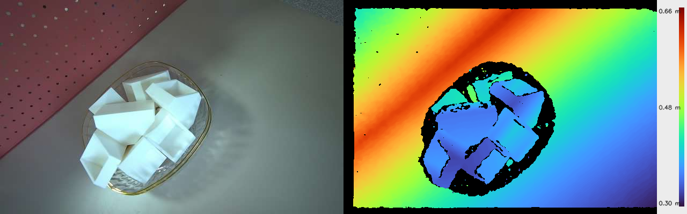
</div>

示例原始输入（**`000000`–`000003`** 亦在 [Hugging Face — test_imgs_RGBD](https://huggingface.co/datasets/SEU-WYL/HccePose/tree/main/test_imgs_RGBD)）：**`test_imgs_RGBD/000003_rgb.png`**、**`000003_depth.png`**、**`000003_camK.json`**。

---

#### 📸 示例：FoundationPose RGB-D 微调

运行 **`s4_p3_test_mi10_bin_picking_RGBD_foundationpose.py`**（需先放置 FoundationPose 权重）。需要 HccePose 或 FoundationPose 调试图时，打开 **`hccepose_vis`** / **`foundationpose_vis`**（默认写入 `capture_dir` 下，与脚本一致）。

<details>
<summary>点击展开代码</summary>

```python
import cv2, os, sys
from HccePose.bop_loader import bop_dataset
from HccePose.test_script_utils import print_stage_time_breakdown, save_visual_artifacts
from HccePose.tester import Tester
from Refinement.refinement_test_utils import load_capture_frame, list_capture_frame_names


if __name__ == '__main__':

    sys.path.insert(0, os.getcwd())
    current_dir = os.path.dirname(sys.argv[0])
    dataset_path = os.path.join(current_dir, 'demo-bin-picking')
    capture_dir = os.path.join(current_dir, 'test_imgs_RGBD')
    foundationpose_refine_dir = os.path.join(current_dir, '2023-10-28-18-33-37')
    foundationpose_score_dir = os.path.join(current_dir, '2024-01-11-20-02-45')
    bop_dataset_item = bop_dataset(dataset_path)
    obj_id = 1
    CUDA_DEVICE = '0'
    hccepose_vis = False
    foundationpose_vis = False
    foundationpose_vis_stages = [1, 2, 3, 4, 5, 'score']
    hccepose_acceleration = 'pytorch'
    foundationpose_acceleration = 'pytorch'
    save_visualizations = hccepose_vis or foundationpose_vis
    print_stage_timing = False

    tester_item = Tester(
        bop_dataset_item,
        hccepose_vis=hccepose_vis,
        CUDA_DEVICE=CUDA_DEVICE,
        foundationpose_refine_dir=foundationpose_refine_dir,
        foundationpose_score_dir=foundationpose_score_dir,
        hccepose_acceleration=hccepose_acceleration,
        foundationpose_acceleration=foundationpose_acceleration,
    )
    frame_names = list_capture_frame_names(capture_dir)
    for name in frame_names:
        image, depth, depth_m, cam_K = load_capture_frame(capture_dir, name)

        results_dict = tester_item.predict(
            cam_K,
            image,
            [obj_id],
            conf=0.85,
            confidence_threshold=0.85,
            depth=depth_m,
            use_foundationpose=True,
            foundationpose_vis=foundationpose_vis,
            foundationpose_vis_stages=foundationpose_vis_stages,
        )
        print_stage_time_breakdown(results_dict, enabled=print_stage_timing, prefix=name)
        save_visual_artifacts([
            (os.path.join(capture_dir, '%s_show_2d.jpg' % name), results_dict.get('show_2D_results')),
            (os.path.join(capture_dir, '%s_show_6d_vis0.jpg' % name), results_dict.get('show_6D_vis0')),
            (os.path.join(capture_dir, '%s_show_6d_vis1.jpg' % name), results_dict.get('show_6D_vis1')),
            (os.path.join(capture_dir, '%s_show_6d_vis2.jpg' % name), results_dict.get('show_6D_vis2')),
            (os.path.join(capture_dir, '%s_show_foundationpose.jpg' % name), results_dict.get('show_foundationpose')),
        ], enabled=save_visualizations)
```

与仓库 **`s4_p3_test_mi10_bin_picking_RGBD_foundationpose.py`** 一致。

</details>

---

#### 🎯 可视化结果（FoundationPose）

帧 **`000003`** 上 FoundationPose 融合视图及解码后的 HccePose 风格图（文档用图位于 **`show_vis/`**）：

<div align="center">
 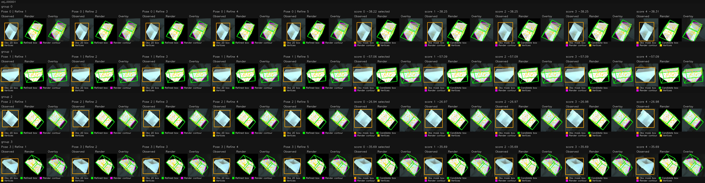
</div>

<div align="center">
 
 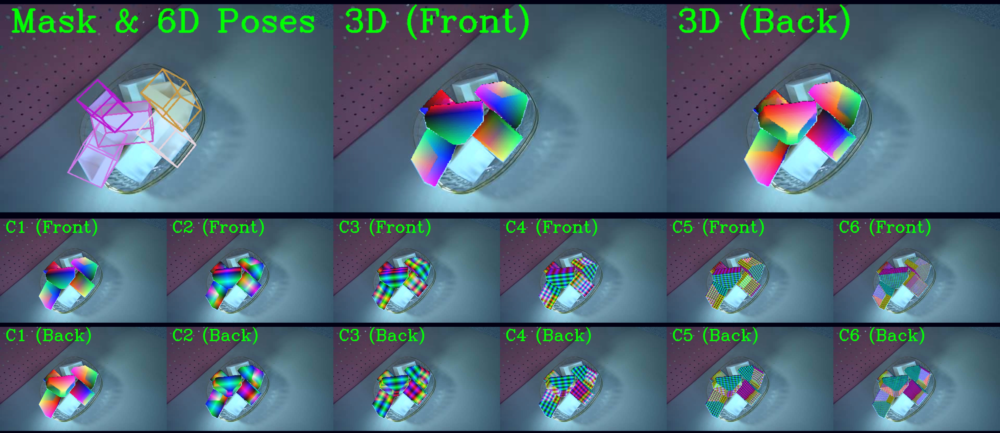
</div>

---

#### 📸 示例：MegaPose 微调（RGB-D 分支）

**`s4_p3_test_mi10_bin_picking_RGBD_megapose.py`** 中 **`megapose_use_depth=True`** 对应 **`megapose_variant_name='rgbd'`**；改为 **`False`** 即 RGB-only（文件名后缀为 **`rgb`**）。

<details>
<summary>点击展开代码</summary>

```python
import os, sys
import cv2
from HccePose.bop_loader import bop_dataset
from HccePose.test_script_utils import print_stage_time_breakdown, save_visual_artifacts
from HccePose.tester import Tester
from Refinement.refinement_test_utils import load_capture_frame, list_capture_frame_names


if __name__ == '__main__':

    sys.path.insert(0, os.getcwd())
    current_dir = os.path.dirname(sys.argv[0])
    dataset_path = os.path.join(current_dir, 'demo-bin-picking')
    capture_dir = os.path.join(current_dir, 'test_imgs_RGBD')
    bop_dataset_item = bop_dataset(dataset_path)
    obj_id = 1
    CUDA_DEVICE = '0'
    hccepose_vis = True
    hccepose_acceleration = 'pytorch'
    megapose_use_depth = True
    megapose_vis = True
    megapose_vis_stages = [1, 2, 3, 4, 5]
    megapose_variant_name = 'rgbd' if megapose_use_depth else 'rgb'
    save_visualizations = hccepose_vis or megapose_vis
    print_stage_timing = False

    tester_item = Tester(
        bop_dataset_item,
        hccepose_vis=hccepose_vis,
        CUDA_DEVICE=CUDA_DEVICE,
        hccepose_acceleration=hccepose_acceleration,
    )

    frame_names = list_capture_frame_names(capture_dir)
    for name in frame_names:
        image, depth, depth_m, cam_K = load_capture_frame(capture_dir, name)
        megapose_depth = depth_m if megapose_use_depth else None

        results_mp = tester_item.predict(
            cam_K,
            image,
            [obj_id],
            conf=0.85,
            confidence_threshold=0.85,
            depth=megapose_depth,
            use_megapose=True,
            megapose_vis=megapose_vis,
            megapose_vis_stages=megapose_vis_stages,
        )
        print_stage_time_breakdown(results_mp, enabled=print_stage_timing, prefix='%s | MegaPose %s' % (name, megapose_variant_name.upper()))

        save_visual_artifacts([
            (os.path.join(capture_dir, '%s_show_megapose.jpg' % name), results_mp.get('show_megapose')),
            (os.path.join(capture_dir, '%s_megapose_%s_show_2d.jpg' % (name, megapose_variant_name)), results_mp.get('show_2D_results')),
            (os.path.join(capture_dir, '%s_megapose_%s_show_6d_vis0.jpg' % (name, megapose_variant_name)), results_mp.get('show_6D_vis0')),
            (os.path.join(capture_dir, '%s_megapose_%s_show_6d_vis1.jpg' % (name, megapose_variant_name)), results_mp.get('show_6D_vis1')),
            (os.path.join(capture_dir, '%s_megapose_%s_show_6d_vis2.jpg' % (name, megapose_variant_name)), results_mp.get('show_6D_vis2')),
        ], enabled=save_visualizations)
```

与仓库 **`s4_p3_test_mi10_bin_picking_RGBD_megapose.py`** 一致。

</details>

---

#### 🎯 可视化结果（MegaPose RGB-D）

**`rgbd`** 变体在 **`000003`** 上的 MegaPose 调试图与解码图：

<div align="center">
 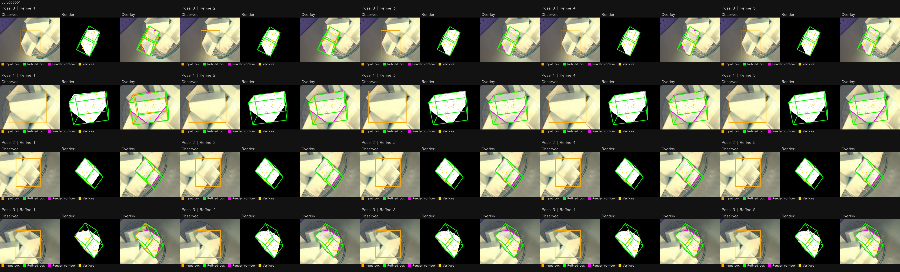
</div>

<div align="center">
 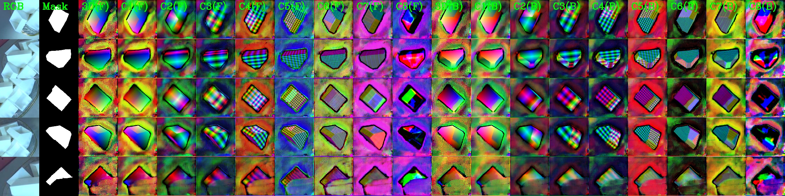
 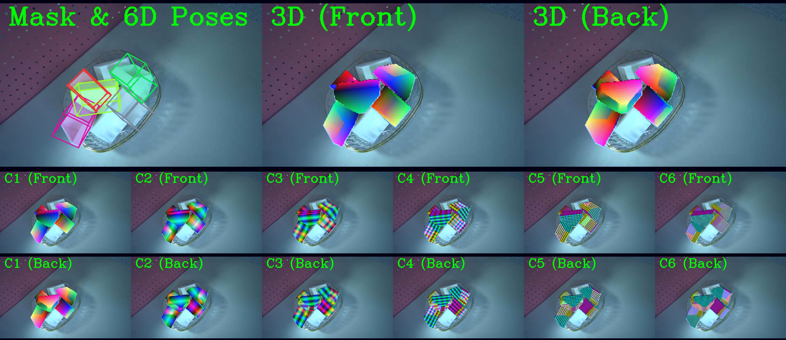
</div>

同一帧 **仅 RGB** 的 MegaPose（`megapose_use_depth=False`）：

<div align="center">
 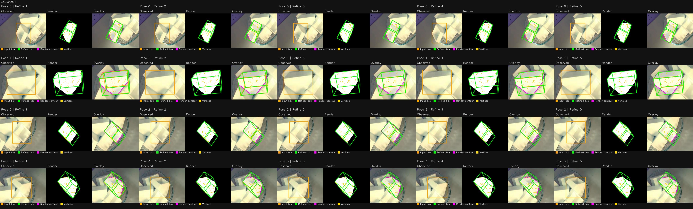
</div>

---

#### 📸 示例：HccePose / FoundationPose / MegaPose 对比与深度融合

**`s4_p3_test_mi10_bin_picking_RGBD_FP_vs_MP.py`** 对每一帧依次跑 HccePose（带深度）、FoundationPose、MegaPose 的 **rgb** 与 **rgbd**，保存叠加图，并用 **`build_depth_comparison_visual`** 生成深度对比拼图。文件中还定义了 **`print_foundationpose_benchmark`**，用于在**首帧**上对比 FoundationPose 不同后端（PyTorch/ONNX/TensorRT）；下述代码块为**逐帧主流程**，完整可运行版本请以仓库文件为准。脚本默认 **`foundationpose_acceleration='onnx'`**；本 README 的 **PyTorch 2.8.0+cu128** 安装行已包含 **`torch.backends.mha`**，满足 ONNX 导出所需。若仍使用 **较旧版本（如 PyTorch 2.2）**，可能出现 **`AttributeError: module 'torch.backends' has no attribute 'mha'`**——请升级 PyTorch，或在脚本中改为非 ONNX 的加速选项（视环境而定）。

<details>
<summary>点击展开代码（逐帧主流程）</summary>

```python
import cv2, os, sys
import numpy as np
from HccePose.bop_loader import bop_dataset
from HccePose.test_script_utils import print_stage_time_breakdown, save_visual_artifacts
from HccePose.tester import Tester
from Refinement.refinement_test_utils import build_depth_comparison_visual, load_capture_frame, list_capture_frame_names

# 同文件中还定义 print_foundationpose_benchmark 等辅助函数，位于 __main__ 之前；
# 请直接运行 s4_p3_test_mi10_bin_picking_RGBD_FP_vs_MP.py 获取完整脚本。

if __name__ == '__main__':

    sys.path.insert(0, os.getcwd())
    current_dir = os.path.dirname(sys.argv[0])
    dataset_path = os.path.join(current_dir, 'demo-bin-picking')
    capture_dir = os.path.join(current_dir, 'test_imgs_RGBD')
    foundationpose_refine_dir = os.path.join(current_dir, '2023-10-28-18-33-37')
    foundationpose_score_dir = os.path.join(current_dir, '2024-01-11-20-02-45')
    bop_dataset_item = bop_dataset(dataset_path)
    obj_id = 1
    obj_index = list(bop_dataset_item.obj_id_list).index(obj_id)
    obj_model_path = bop_dataset_item.obj_model_list[obj_index]
    CUDA_DEVICE = '0'
    hccepose_vis = True
    hccepose_acceleration = 'pytorch'
    foundationpose_vis = False
    foundationpose_vis_stages = [1, 2, 3, 4, 5, 'score']
    foundationpose_acceleration = 'onnx'
    megapose_vis = True
    megapose_vis_stages = [1, 2, 3, 4, 5]
    megapose_variants = [('rgbd', True), ('rgb', False)]
    save_visualizations = hccepose_vis or foundationpose_vis or megapose_vis
    print_stage_timing = False

    foundationpose_runner = Tester(
        bop_dataset_item,
        hccepose_vis=hccepose_vis,
        CUDA_DEVICE=CUDA_DEVICE,
        foundationpose_refine_dir=foundationpose_refine_dir,
        foundationpose_score_dir=foundationpose_score_dir,
        hccepose_acceleration=hccepose_acceleration,
        foundationpose_acceleration=foundationpose_acceleration,
    )
    megapose_runner = Tester(
        bop_dataset_item,
        hccepose_vis=hccepose_vis,
        CUDA_DEVICE=CUDA_DEVICE,
        hccepose_acceleration=hccepose_acceleration,
    )

    frame_names = list_capture_frame_names(capture_dir)
    # 可选：对 frame_names[0] 调用 print_foundationpose_benchmark(...)，见仓库原文件。

    for name in frame_names:
        image, depth, depth_m, cam_K = load_capture_frame(capture_dir, name)

        results_hccepose = foundationpose_runner.predict(
            cam_K,
            image,
            [obj_id],
            conf=0.85,
            confidence_threshold=0.85,
            depth=depth_m,
        )
        results_fp = foundationpose_runner.predict(
            cam_K,
            image,
            [obj_id],
            conf=0.85,
            confidence_threshold=0.85,
            depth=depth_m,
            use_foundationpose=True,
            foundationpose_vis=foundationpose_vis,
            foundationpose_vis_stages=foundationpose_vis_stages,
        )

        print_stage_time_breakdown(results_hccepose, enabled=print_stage_timing, prefix='%s | HccePose' % name)
        print_stage_time_breakdown(results_fp, enabled=print_stage_timing, prefix='%s | FoundationPose' % name)

        save_visual_artifacts([
            (os.path.join(capture_dir, '%s_hccepose_show_2d.jpg' % name), results_hccepose.get('show_2D_results')),
            (os.path.join(capture_dir, '%s_hccepose_show_6d_vis0.jpg' % name), results_hccepose.get('show_6D_vis0')),
            (os.path.join(capture_dir, '%s_hccepose_show_6d_vis1.jpg' % name), results_hccepose.get('show_6D_vis1')),
            (os.path.join(capture_dir, '%s_hccepose_show_6d_vis2.jpg' % name), results_hccepose.get('show_6D_vis2')),
            (os.path.join(capture_dir, '%s_foundationpose_show_2d.jpg' % name), results_fp.get('show_2D_results')),
            (os.path.join(capture_dir, '%s_foundationpose_show_6d_vis0.jpg' % name), results_fp.get('show_6D_vis0')),
            (os.path.join(capture_dir, '%s_foundationpose_show_6d_vis1.jpg' % name), results_fp.get('show_6D_vis1')),
            (os.path.join(capture_dir, '%s_foundationpose_show_6d_vis2.jpg' % name), results_fp.get('show_6D_vis2')),
            (os.path.join(capture_dir, '%s_show_foundationpose.jpg' % name), results_fp.get('show_foundationpose')),
        ], enabled=save_visualizations)

        for megapose_variant_name, megapose_use_depth in megapose_variants:
            megapose_depth = depth_m if megapose_use_depth else None
            results_mp = megapose_runner.predict(
                cam_K,
                image,
                [obj_id],
                conf=0.85,
                confidence_threshold=0.85,
                depth=megapose_depth,
                use_megapose=True,
                megapose_vis=megapose_vis,
                megapose_vis_stages=megapose_vis_stages,
            )

            print_stage_time_breakdown(results_mp, enabled=print_stage_timing, prefix='%s | MegaPose %s' % (name, megapose_variant_name.upper()))

            save_visual_artifacts([
                (os.path.join(capture_dir, '%s_show_megapose_%s.jpg' % (name, megapose_variant_name)), results_mp.get('show_megapose')),
                (os.path.join(capture_dir, '%s_megapose_%s_show_2d.jpg' % (name, megapose_variant_name)), results_mp.get('show_2D_results')),
                (os.path.join(capture_dir, '%s_megapose_%s_show_6d_vis0.jpg' % (name, megapose_variant_name)), results_mp.get('show_6D_vis0')),
                (os.path.join(capture_dir, '%s_megapose_%s_show_6d_vis1.jpg' % (name, megapose_variant_name)), results_mp.get('show_6D_vis1')),
                (os.path.join(capture_dir, '%s_megapose_%s_show_6d_vis2.jpg' % (name, megapose_variant_name)), results_mp.get('show_6D_vis2')),
            ], enabled=save_visualizations)

            pose_sets_mm = {}
            if obj_id in results_hccepose and 'Rts' in results_hccepose[obj_id]:
                pose_sets_mm['HccePose'] = results_hccepose[obj_id]['Rts']
            if obj_id in results_fp and 'Rts' in results_fp[obj_id]:
                pose_sets_mm['FoundationPose'] = results_fp[obj_id]['Rts']
            if obj_id in results_mp and 'Rts' in results_mp[obj_id]:
                pose_sets_mm['MegaPose'] = results_mp[obj_id]['Rts']
            if save_visualizations:
                depth_compare_vis, depth_compare_summary = build_depth_comparison_visual(
                    depth,
                    cam_K,
                    obj_model_path,
                    pose_sets_mm,
                    device=str(foundationpose_runner.device),
                    max_items=4,
                )
                save_visual_artifacts([
                    (os.path.join(capture_dir, '%s_compare_depth_hccepose_foundationpose_megapose_%s.jpg' % (name, megapose_variant_name)), depth_compare_vis),
                ], enabled=True)
```

权威完整版本见 **`s4_p3_test_mi10_bin_picking_RGBD_FP_vs_MP.py`**。

</details>

---

#### 🎯 可视化结果（深度对比）

**MegaPose RGB** 与 **MegaPose RGB-D** 两种分支下的深度对齐对比（`000003`）：

<div align="center">
 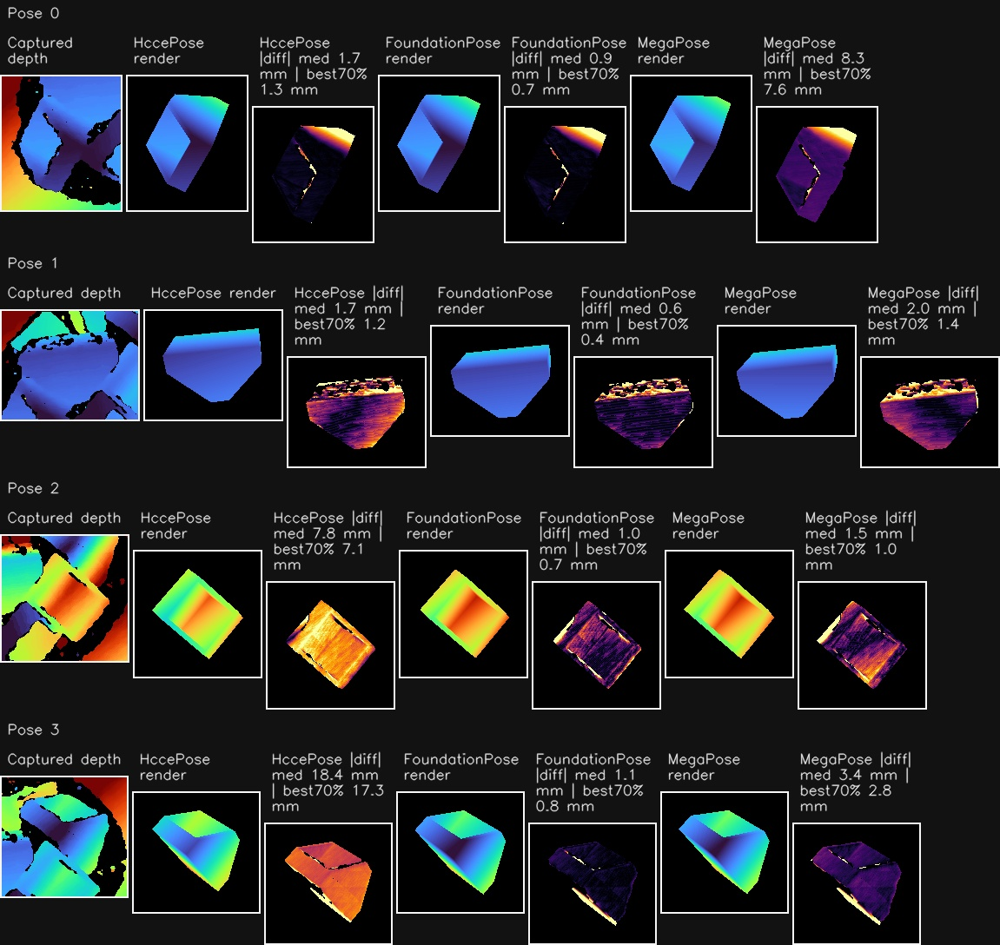
</div>

<div align="center">
 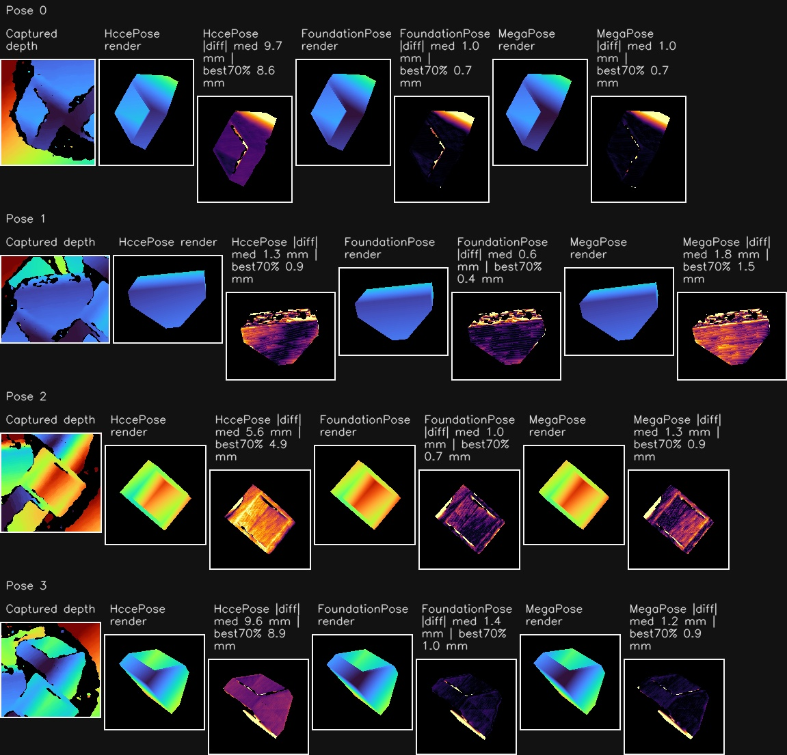
</div>

---


## 🧪 BOP挑战测试

您可以使用脚本[**`s4_p2_test_bf_pbr_bop_challenge.py`**](/s4_p2_test_bf_pbr_bop_challenge.py)来测试 **HccePose** 在七个 BOP 核心数据集上的表现。

#### 训练权重文件

| 数据集 | 权重链接 |
|----------|---------------|
| **LM-O** | [Hugging Face - LM-O](https://huggingface.co/datasets/SEU-WYL/HccePose/tree/main/lmo/HccePose) |
| **YCB-V** | [Hugging Face - YCB-V](https://huggingface.co/datasets/SEU-WYL/HccePose/tree/main/ycbv/HccePose) |
| **T-LESS** | [Hugging Face - T-LESS](https://huggingface.co/datasets/SEU-WYL/HccePose/tree/main/tless/HccePose) |
| **TUD-L** | [Hugging Face - TUD-L](https://huggingface.co/datasets/SEU-WYL/HccePose/tree/main/tudl/HccePose) |
| **HB** | [Hugging Face - HB](https://huggingface.co/datasets/SEU-WYL/HccePose/tree/main/hb/HccePose) |
| **ITODD** | [Hugging Face - ITODD](https://huggingface.co/datasets/SEU-WYL/HccePose/tree/main/itodd/HccePose) |
| **IC-BIN** | [Hugging Face - IC-BIN](https://huggingface.co/datasets/SEU-WYL/HccePose/tree/main/icbin/HccePose) |

---

#### 示例：LM-O 数据集

以 BOP 中最广泛使用的 **LM-O 数据集** 为例，我们采用了 **BOP2023 挑战** 中的 [默认 2D 检测器](https://bop.felk.cvut.cz/media/data/bop_datasets_extra/bop23_default_detections_for_task1.zip)（GDRNPP），对 **HccePose(BF)** 进行了测试，并保存了以下结果文件：

- 2D 分割结果：[seg2d_lmo.json](https://huggingface.co/datasets/SEU-WYL/HccePose/blob/main/lmo/seg2d_lmo.json)
- 6D 位姿结果：[det6d_lmo.csv](https://huggingface.co/datasets/SEU-WYL/HccePose/blob/main/lmo/det6d_lmo.csv)

我们于 **2025 年 10 月 20 日** 提交了这两个文件。测试结果如下图所示。  
**6D 定位分数** 与 2024 年提交结果保持一致，  
**2D 分割分数** 提高了 **0.002**，这得益于我们修复了一些细微的程序 bug。
<details>
<summary>点击展开</summary>
<div align="center">
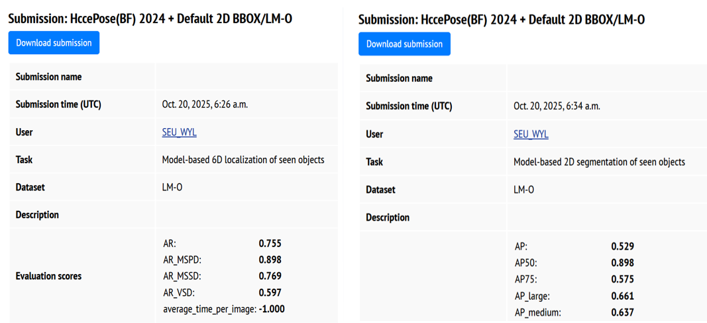
</div>
</details>

---

#### ⚙️ 说明

- 如果您发现某些权重文件的轮数为 **`0`**，这并不是错误。**HccePose(BF)** 的权重文件都是基于仅使用前表面训练的标准 HccePose 再训练得到的，在某些情况下，初始权重即能达到最佳性能。

---

## 📅 更新计划

我们目前正在整理和更新以下模块：

- 📁 ~~七个核心 BOP 数据集的 HccePose(BF) 权重文件~~

- 🧪 ~~BOP 挑战测试流程~~

- 🔁 基于前后帧跟踪的 6D 位姿推理

- 🏷️ 基于 HccePose(BF) 的真实场景 6D 位姿数据集制备

- ⚙️ PBR + Real 训练流程

- 📘 关于~~物体预处理~~、~~数据渲染~~、~~YOLOv11标签制备与训练~~以及HccePose(BF)的~~标签制备~~与~~训练~~的教程

预计所有模块将在 2025 年底前完成，并尽可能 每日持续更新。

---

## 🏆 BOP榜单
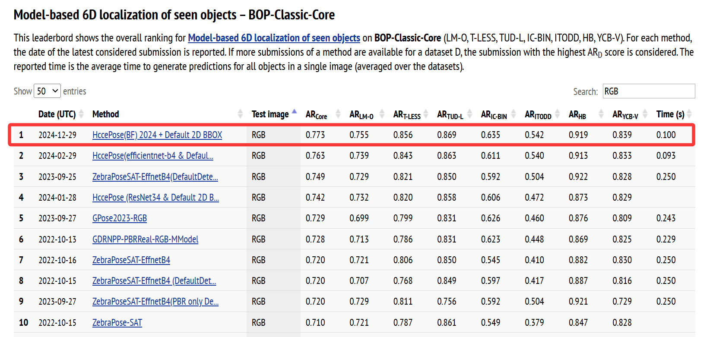
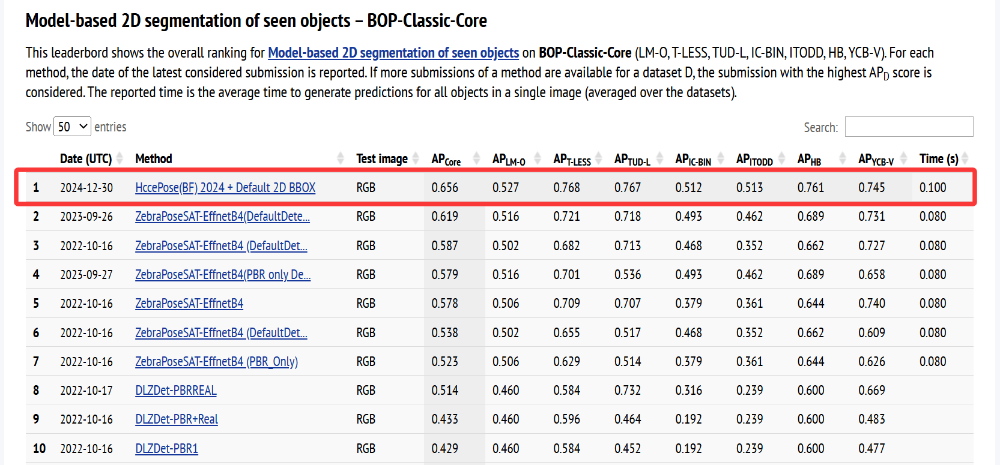

## 致谢

本项目直接依赖或引用的公开数据集、评测流程与位姿/微调相关工作中，包括但不限于：[**BOP**](https://bop.felk.cvut.cz/) 与 [**bop_toolkit**](https://github.com/thodan/bop_toolkit)、[**BlenderProc**](https://github.com/DLR-RM/BlenderProc)、[**Ultralytics YOLO**](https://github.com/ultralytics/ultralytics)、[**FoundationPose**](https://github.com/NVlabs/FoundationPose)、[**MegaPose**](https://github.com/megapose6d/megapose6d)、[**KASAL**](https://pypi.org/project/kasal-6d/)。

***
如果您觉得我们的工作有帮助，请按以下方式引用：
```bibtex
@InProceedings{HccePose_BF,
    author    = {Wang, Yulin and Hu, Mengting and Li, Hongli and Luo, Chen},
    title     = {HccePose(BF): Predicting Front \& Back Surfaces to Construct Ultra-Dense 2D-3D Correspondences for Pose Estimation},
    booktitle = {Proceedings of the IEEE/CVF International Conference on Computer Vision (ICCV)},
    month     = {October},
    year      = {2025},
    pages     = {7166-7175}
}
```